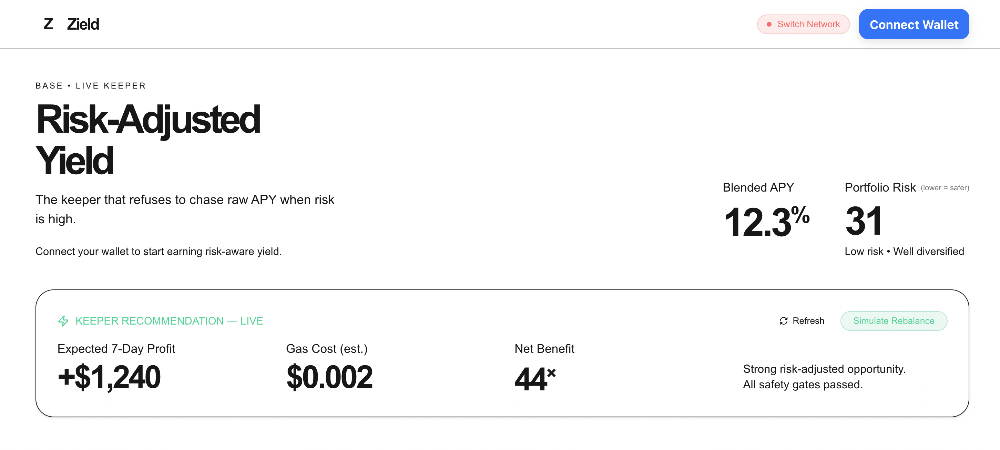

# Zield — Risk-Aware Yield Vault (MVP)

**Zield** is a yield optimization vault that actively reallocates capital across DeFi strategies to maximize **risk-adjusted returns**, not raw APY.



*Live dashboard showing the keeper’s current risk-adjusted recommendation, portfolio allocation, and deposit/withdraw experience.*

This repository contains the **doable MVP** implementation. All longer-term multichain, intent-based, insurance-wrapped, and on-chain optimization ideas have been deliberately moved to [ZIELD_VISION_PLANS_AND_ROADMAP.md](./ZIELD_VISION_PLANS_AND_ROADMAP.md).

## Current MVP Scope (What We're Actually Shipping First)

- **Chain**: Base (best combination of low fees + real yield depth in 2025/2026)
- **Asset**: USDC (most liquid stable with broad strategy surface)
- **Core Contract**: `ZieldVault` (ERC-4626) with pluggable strategies and privileged rebalancing
- **Initial Strategies** (3):
  1. Real Aave v3 USDC supply adapter
  2. Mock Conservative yield (for testing + comparison)
  3. Mock Aggressive yield (high APY, high simulated risk)
- **Risk Model + Optimizer**: Off-chain (TypeScript), transparent, versioned. The contract itself stays relatively "dumb" about yields and risk so we can improve the brain without constant upgrades.
- **Keeper**: Simple but robust TS script that can simulate then execute rebalances.
- **Frontend**: Next.js + wagmi/viem dashboard (deposit, withdraw, live allocation + blended APY + risk view).

**Guiding constraint**: Everything in this repo must be understandable, testable on forks, and deployable by a small team with real security review.

## Why This Approach?

Most yield aggregators either:
- Blindly chase the highest number (dangerous), or
- Are too conservative and leave yield on the table.

Zield's thesis is that a **high-quality, frequently updated risk model + disciplined execution** can deliver better outcomes for users than either extreme — especially when capital can be moved efficiently.

The MVP proves the loop:
1. User deposits USDC
2. Off-chain Risk Engine scores current opportunities
3. Optimizer outputs target allocations
4. Keeper executes rebalance on-chain (harvest → withdraw excess → deposit to underweight)
5. User can withdraw anytime (ERC-4626)

## Project Structure

```
zield/
├── contracts/                 # Hardhat + Solidity (the vault + strategy adapters)
├── keeper/                    # Risk engine + optimizer + execution bot (TS)
├── frontend/                  # User + keeper dashboard (Next.js)
├── packages/                  # Shared config, ABIs, types (future)
├── ZIELD_VISION_PLANS_AND_ROADMAP.md   # All the ambitious future stuff (read only after MVP)
└── ARCHITECTURE.md            # Detailed MVP design decisions
```

## Quick Start (Contracts)

```bash
cd contracts

# 1. Install
npm install

# 2. Copy env
cp .env.example .env
# Edit with RPCs + keys

# 3. Compile
npm run compile

# 4. Run tests (uses mainnet fork by default for realism)
npm test
```

See `contracts/README.md` (to be expanded) and `ARCHITECTURE.md` for full details.

## Risk Model (MVP Version)

The initial risk model uses four axes, each scored 0–100:

- **Smart Contract Risk** — Audit quality, complexity, upgradeability, historical incidents, team reputation
- **Market Risk** — Volatility, IL exposure, basis/depeg risk, correlation to other positions
- **Liquidity & Exit Risk** — Pool depth, withdrawal queues, bridge dependency, redemption gates
- **Operational Risk** — Keeper dependency, oracle reliance, governance attack surface, monitoring gaps

A simple transparent formula (implemented in the keeper) converts these + current net APY into a risk-adjusted score. Allocations are constrained (no single strategy > X%, aggressive bucket capped, etc.).

The model parameters live in the keeper service (versioned) and can be updated with clear change logs. Later we may move a subset on-chain with timelocks.

## Current Status & Roadmap (MVP Only)

**Completed (this session)**
- Vision document saved
- Project scaffolding (Hardhat contracts)
- Core `ZieldVault` (ERC-4626 + strategy registry + rebalance)
- `IStrategy` interface
- Real Aave v3 adapter skeleton
- Controllable `MockYieldStrategy` for fast iteration
- Basic deploy script

**Next Immediate Work (in priority order)**
1. Solid fork tests for deposit → allocation → rebalance → withdraw flow
2. Risk Engine + Optimizer in `keeper/` (the actual brain)
3. Keeper execution script with simulation + safety checks
4. Frontend (deposit/withdraw + transparent dashboard)
5. Real second strategy (Aerodrome or Morpho on Base)

## Run It Right Now (Current State)

**Keeper (live data + optimizer + safety gates)**
```bash
cd keeper && npm run dev
```

**Dry Run (recommended before any execution)**
```bash
cd keeper && VAULT_ADDRESS=0xYourVault npm run dry-run
```

**Execute Rebalance (heavily guarded)**
```bash
cd keeper && VAULT_ADDRESS=0xYourVault KEEPER_PRIVATE_KEY=0x... npm run execute
```

**Frontend Dashboard**
```bash
cd frontend && npm run dev
```
Beautiful risk-capped allocation view that matches real keeper output.

**Contract validation**
```bash
cd contracts && npx hardhat run scripts/test-rebalance-flow.ts
```

### Deploy to Base Sepolia (Best Way to See the Full System)

This is the fastest way to have a real, observable end-to-end Zield system.

1. Get Sepolia ETH + test USDC (Circle faucet recommended).
2. In `contracts/.env` set your `DEPLOYER_PRIVATE_KEY`.
3. Run:
   ```bash
   cd contracts
   npm run deploy:sepolia
   ```
4. Copy the Vault address from the output.
5. In `keeper/.env` set `VAULT_ADDRESS=0x...`
6. Start the keeper + frontend. Connect your wallet on Base Sepolia in the UI and deposit.

The keeper will now read the real deployed vault state on every run. You can change mock strategy APYs and risk scores on-chain and watch the optimizer + safety gates react.

## Important Disclaimers

- This is early software. Do not put money you cannot afford to lose into any deployment until multiple security reviews and a track record exist.
- The "risk-aware" claim is only as good as the model and the data feeding it. Models can be wrong.
- Rebalancing has costs. The system must clear those costs or it hurts users.

## License

MIT (for now — may change for production contracts).

---

**Start here if you want the big picture**: [ZIELD_VISION_PLANS_AND_ROADMAP.md](./ZIELD_VISION_PLANS_AND_ROADMAP.md)

**Start here for the actual thing we're building right now**: `ARCHITECTURE.md` + the `contracts/` folder.
